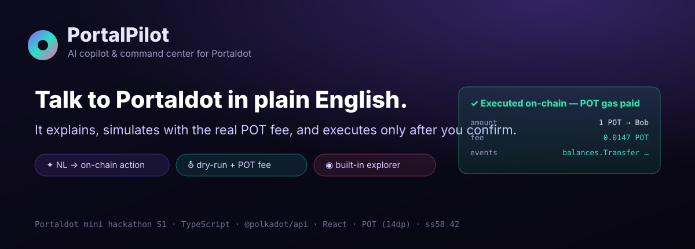

# ◉ PortalPilot

### The AI copilot & command center for **Portaldot**



> **Talk to Portaldot in plain English.** PortalPilot understands your intent, **simulates the transaction on-chain (`system_dryRun`)**, shows the **exact POT gas fee**, and **executes only after you confirm** — then hands you the on-chain receipt. Because Portaldot has no public block explorer, PortalPilot ships one built in.

**Hackathon:** Portaldot Online Mini Hackathon S1 · **Primary track:** AI-Powered Onchain Workflows (with Builder-Tools & Native-App value) · **Stack:** TypeScript · `@polkadot/api` · React/Vite · Node/Express

---

## The problem

Portaldot is a Substrate chain with real capabilities (ink! contracts, 25 pallets, 155 extrinsics) — but its developer & user experience is bare:

- ❌ **No block explorer** is linked anywhere.
- ❌ **No JS/TS SDK** — the only documented SDK is Python (`substrate-interface`).
- ❌ **No faucet**, thin docs, and a steep Rust/Substrate learning curve.
- ❌ To do *anything* you must hand-craft extrinsics and know the chain's quirks (e.g. **POT uses 14 decimals**, ss58 prefix 42 — easy to get 100× wrong).

The result: even reading a balance or sending POT is hard for newcomers, and impossible for non-developers.

## The solution

**PortalPilot** turns the whole chain into a conversation, safely:

| Ask (read, no gas) | Act (write, POT gas, confirmed) |
|---|---|
| “balance of alice” | “send 1 POT to bob” |
| “show last 5 blocks” | “airdrop 1 POT to bob and 2 POT to charlie” |
| “recent transfers” | “post on-chain remark: gm Portaldot” |
| “network status” / “what can I do?” | “fee to send 5 POT to bob” (preview only) |

Every **state-changing** request becomes a **plan** you can see before anything is signed:

```
natural language → intent → extrinsic plan → system.dryRun → POT fee preview → YOU confirm → signed submit → on-chain receipt
```

This is not “AI as a label.” The AI (or the built-in deterministic parser) only **proposes**; the chain itself **simulates**; and **you** authorize. It mirrors the defense-in-depth pattern for autonomous on-chain agents where *transaction simulation before signing* is the critical safety layer ([arXiv:2601.04583](https://arxiv.org/html/2601.04583v1)).

---

## Why this is hard to replicate (and judge-ready)

- ✅ **Native deployment + POT gas (mandatory):** PortalPilot composes and submits **real Portaldot extrinsics** (`balances.transferKeepAlive`, `utility.batchAll`, `system.remarkWithEvent`) that pay **POT** gas — confirmed by the `treasury.Deposit` + `system.ExtrinsicSuccess` events on every executed tx.
- ✅ **Metadata-driven:** it reads the live runtime metadata, so it understands the chain’s real pallets/calls — not one hard-coded transaction.
- ✅ **Correct where others break:** centralized handling of **14-decimal** POT math and **ss58-42** addresses (the local dev node doesn’t even advertise `system.properties`, which silently breaks naïve tools).
- ✅ **Three surfaces from one data layer:** a copilot (AI track), a live explorer (the missing tool), and the **first community JS/TS SDK** for Portaldot (Builder-Tools gift) — multi-track value at low marginal cost.
- ✅ **Demo-proof safety:** if the dry-run says it would fail, the **Confirm button is disabled**. Garbage input is rejected with suggestions. Bad addresses/amounts are caught before signing.

---

## Live proof (captured 2026-05-29)

```
Mainnet  wss://mainnet.portaldot.io  →  "Portaldot Mainnet"  block #2,526,762  POT 14dp  25 pallets / 155 extrinsics
Executed (local Portaldot node, real POT gas):
  PLAN  Transfer 1 POT → 5FHneW…M694ty   fee 0.0147 POT   dry-run: "Simulation succeeded"
  TX    block 0x7fd88c…ab97be   events: balances.Transfer, treasury.Deposit, system.ExtrinsicSuccess
```

> _The running app: the green card is a **real on-chain receipt**; the right rail is the **built-in live explorer**. Flip to **Mainnet** for live data, **Local** to execute. (Drop a live still at `docs/screenshot.png`.)_

---

## Architecture

```
┌──────────────────────────┐     /api (ask · execute · chain · blocks)     ┌───────────────────────────┐
│  React + Vite web app     │  ───────────────────────────────────────────▶ │  Node / Express backend    │
│  • chat copilot           │ ◀───────────────────────────────────────────  │  • intent engine           │
│  • tx preview / confirm   │      plan (dry-run + POT fee) · receipt        │  • PortalPilot SDK         │
│  • live block explorer    │                                                │  • server-side signer      │
└──────────────────────────┘                                                └────────────┬──────────────┘
                                                                                          │ @polkadot/api
                                              reads · dry-run · fee  ┌───────────────────┐ │ writes (POT gas)
                                              ───────────────────────│  Portaldot chain  │◀┘
                                                                     │  mainnet / local  │
                                                                     └───────────────────┘
```

- **`src/sdk/`** — the reusable, Portaldot-preconfigured TypeScript SDK (connection, accounts, fees, dry-run, blocks, tx build/sign/submit). *Usable on its own.*
- **`src/intent/`** — deterministic NL parser (zero-dependency core) + optional Claude layer.
- **`src/server.ts`** — REST API; also serves the built web app (single port in production).
- **`app/`** — the React UI (the hero surface).

---

## Quickstart

### Prerequisites
- Node.js ≥ 18, npm
- (For POT-gas **writes**) a Portaldot node. Easiest: the local dev node (Linux binary; on Windows use WSL):

```bash
# in WSL / Linux / macOS
curl -L -o node.tar.gz https://github.com/portaldotVolunteer/Portaldot-node/raw/main/portaldot-testnet-ubuntu.tar.gz
tar -xzvf node.tar.gz && cd portaldot-testnet-ubuntu
chmod +x portaldot_dev
./portaldot_dev --dev --rpc-cors all     # funded Alice/Bob/... at ws://127.0.0.1:9944
```

> Reads, dry-run and fee preview work against **mainnet** out of the box with no node and no tokens. The local node is only needed to *execute* writes (no public faucet exists yet).

### Install & run (dev)
```bash
npm install
npm install --prefix app
npm run dev        # backend (8787) + web (http://localhost:5173)
```

### Build & run (single command, one port)
```bash
npm run build      # installs everything + builds the web app
npm start          # serves UI + API on http://127.0.0.1:8787
```

Then open the app, keep **Local** selected to execute, and try the suggestion chips. Flip to **Mainnet** to browse the real live chain.

---

## Configuration (`.env`, all optional)

```env
PORTALDOT_WS=wss://mainnet.portaldot.io   # default endpoint for reads/dry-run
PORT=8787
PORTALDOT_SIGNER_SEED=//Alice             # server-side demo signer (funded on a --dev node)
ANTHROPIC_API_KEY=                         # set to enable Claude NL understanding (else deterministic parser)
ANTHROPIC_MODEL=claude-haiku-4-5-20251001
```

The deterministic parser means **the full demo works with no API key**. Add a key only to handle free-form phrasing; the safety pipeline (dry-run + confirm) is identical either way.

---

## The SDK as an ecosystem gift

Portaldot had no JS/TS SDK. `src/sdk` is a clean, typed starting point preconfigured for POT (14 dp) and ss58 42:

```ts
import { getAccount, planAction, executePlan } from "./src/sdk";

const alice = await getAccount("5Grwva…GKutQY", "mainnet");   // → "50,000 POT", nonce, identity
const plan  = await planAction({ kind: "transfer", to: "bob", amountPot: "1" }, "local");
//   plan.feeDisplay → "0.0147 POT" ; plan.dryRun.ok → true
const rc    = await executePlan(plan.id);                      // → block hash + events, POT gas paid
```

---

## Track alignment
- **AI-Powered Onchain Workflows** (primary): honest NL→action with simulate-before-sign.
- **Builder Tools for Portaldot:** the missing JS/TS SDK + live explorer.
- **Native Onchain Apps:** a complete user journey on Portaldot’s native pallets.

## Roadmap
Wallet-extension signing · ink! contract deploy/call via the copilot (the chain has `pallet-contracts`) · multisig & scheduled actions · spend limits/allowlists · richer explorer (events, search) · publish `@portalpilot/sdk` to npm.

## License & credits
MIT (yours to build on). Built on [`@polkadot/api`](https://github.com/polkadot-js/api). Core logic is original and open source per the hackathon’s open-by-default rule.
