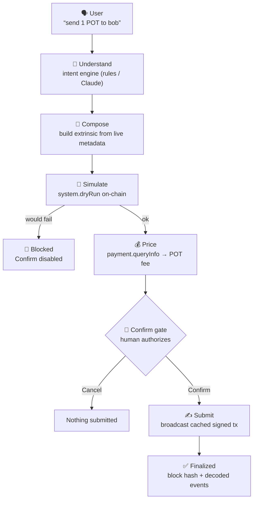
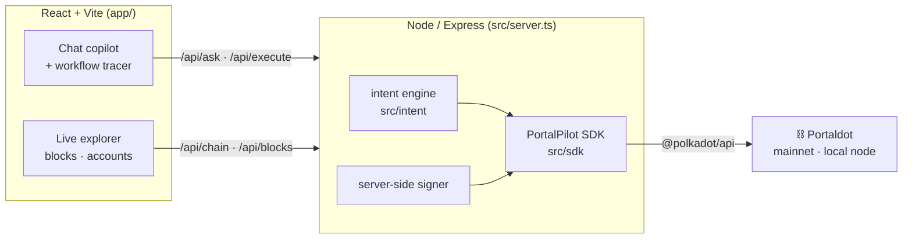
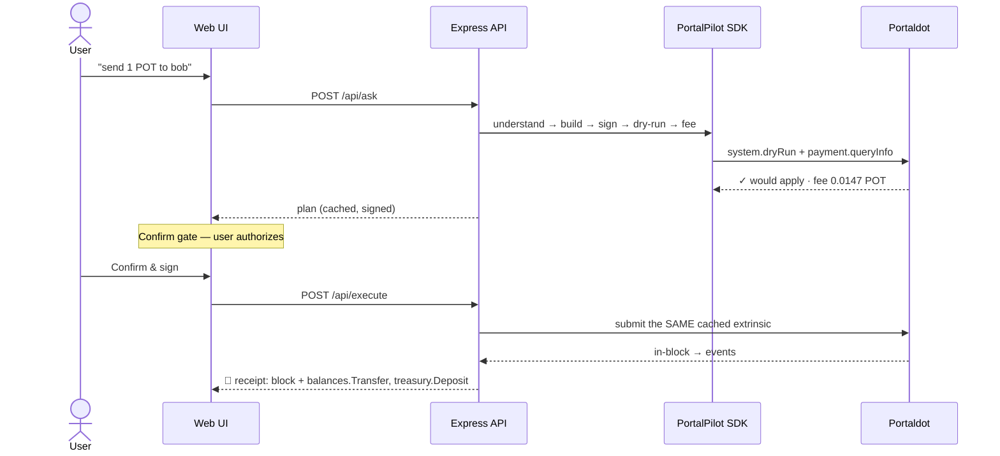
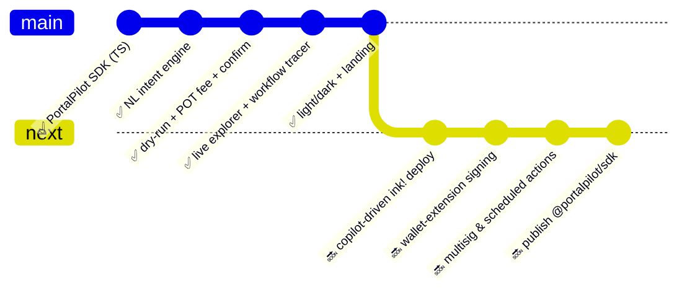

<div align="center">


# ◎ PortalPilot

### *The AI copilot & command center for Portaldot*

<br/>

[](https://dorahacks.io/hackathon/portaldot-online-s1/detail)
[](wss://mainnet.portaldot.io)
[](https://portaldot-dev.readthedocs.io/en/latest/)
[](./src)
[](https://github.com/polkadot-js/api)
[](./LICENSE)

<br/>

> **⚡ Hackathon:** Portaldot Online Mini Hackathon S1 · **Track:** AI‑Powered Onchain Workflows · **Prize Pool:** 3,500 USDT

</div>

---

## 🎯 The Problem — Portaldot is powerful, but unusable for most

```
╔══════════════════════════════════════════════════════════════════════╗
║  Portaldot is a real Substrate chain — ink! contracts, 25 pallets,    ║
║  155 extrinsics, live mainnet. But doing ANYTHING means:              ║
║                                                                       ║
║   ✕  No public block explorer        → you fly blind                  ║
║   ✕  No JS / TS SDK                   → Python-only tooling            ║
║   ✕  No faucet, thin docs            → a steep first hour             ║
║   ✕  Hand-crafted raw extrinsics      → ss58-42 & 14-decimal traps     ║
║   ✕  One wrong byte                   → irreversible loss              ║
║                                              ↓                        ║
║                                  THIS IS WHAT PORTALPILOT FIXES        ║
╚══════════════════════════════════════════════════════════════════════╝
```

Every interaction with Portaldot today assumes you can read Rust, build SCALE‑encoded extrinsics by hand, and never make a mistake. Non‑developers can't use it at all — and developers waste hours on boilerplate before their first transaction.

**PortalPilot closes this gap.**

---

## ⚡ The Solution — one sentence to on‑chain

<div align="center">

```
Plain English  →  intent  →  dry-run on-chain  →  exact POT fee  →  you confirm  →  signed submit  →  on-chain receipt
      ↑                          (system.dryRun)   (payment.queryInfo)      ↑                                ↑
  no Rust required                                                   AI never auto-signs            real block + events
```

</div>

PortalPilot turns the whole chain into a **safe conversation**. You say what you want; it figures out the exact Portaldot extrinsic from the **live runtime metadata**, **simulates it on‑chain**, shows the **exact POT gas fee**, and executes **only after you confirm** — then hands you the on‑chain receipt. Because Portaldot has no explorer, PortalPilot ships one **built in**.

---

## 🔬 Three Core Innovations

<table>
<tr>
<td width="33%" align="center">

### 🧠 Metadata‑driven engine
**Understands the whole chain**

It reads Portaldot's **live runtime metadata**, so it maps your words to any of the chain's real pallets/calls — not one hard‑coded transaction.

```
25 pallets · 155 extrinsics
decoded at runtime
```

Deterministic parser core + optional Claude for free‑form phrasing.

</td>
<td width="33%" align="center">

### 🛡️ Simulate‑before‑sign
**Honest AI, not a label**

Every state change is **dry‑run on‑chain** and **priced in POT** before signing. If the dry‑run would fail, the **Confirm button is disabled.**

```
Understand → Simulate → Price
→ Confirm → Submit → Finalized
```

The exact signed payload you simulate is the one that executes.

</td>
<td width="33%" align="center">

### 🔭 Explorer + JS SDK
**The missing tooling**

A **live block & account explorer** runs beside the chat (Portaldot ships none), and the reusable `src/sdk` is the **first JS/TS SDK** for the chain.

```
blocks · accounts · transfers
fee preview · dry-run
```

Correct ss58‑42 + 14‑decimal math, centralized.

</td>
</tr>
</table>

---

## 🗺️ How It Works — the managed workflow



> The tracer above the transaction card **lights up each stage live** — so judges can *see* the workflow being managed, end to end.

---

## 🏗️ Architecture



- **`src/sdk`** — connection, accounts, tx build/sign/submit, fee preview, dry‑run, blocks (preconfigured for POT 14 dp · ss58 42).
- **`src/intent`** — deterministic NL parser (zero‑dependency) + optional Claude layer.
- **`src/server.ts`** — REST API that also serves the built web app (single port in prod).
- **`app/`** — the React UI: chat, transaction cards, workflow tracer, live explorer, light/dark.

---

## 🔄 Request → Receipt — Sequence



---

## 📦 Module Suite

<details>
<summary><strong>📂 Click to expand — the codebase</strong></summary>

<br/>

| Layer | Module | Purpose |
|---|---|---|
| SDK | `src/sdk/portaldot.ts` | Connection manager, chain info, POT constants (14 dp · ss58 42) |
| SDK | `src/sdk/accounts.ts` | Account lookup, balances, ss58 validation |
| SDK | `src/sdk/tx.ts` | Build transfer/batch/remark, **sign → dry‑run → cache → submit**, fee preview |
| SDK | `src/sdk/blocks.ts` | Recent blocks, block detail, recent transfers |
| SDK | `src/sdk/format.ts` | Precise BigInt POT ⇄ planck (no float math) |
| SDK | `src/sdk/signer.ts` | Server‑side demo signer (`//Alice` by default) |
| Intent | `src/intent/parser.ts` | Deterministic NL → intent (no API key needed) |
| Intent | `src/intent/llm.ts` | Optional Claude layer (free‑form phrasing) |
| Server | `src/server.ts` | `/api/ask`, `/api/execute`, `/api/chain`, `/api/blocks` + serves the UI |
| App | `app/src/Landing.tsx` | Landing page (hero, live demo, why, bento, FAQ) |
| App | `app/src/Dashboard.tsx` | Chat copilot, workflow tracer, live explorer |

</details>

---

## ✅ Verified end‑to‑end (on real Portaldot)

| Check | Result |
|---|:---|
| `@polkadot/api` decodes mainnet metadata | ✅ **25 pallets / 155 extrinsics** |
| Live mainnet read (chain, head, accounts) | ✅ `wss://mainnet.portaldot.io`, block ~2.52M |
| Fee preview (`payment.queryInfo`) | ✅ transfer 1 POT → **0.0147 POT** |
| Dry‑run simulation (`system.dryRun`) | ✅ "would apply cleanly" / blocks on failure |
| **POT‑gas write, local Portaldot node** | ✅ events `balances.Transfer, treasury.Deposit, system.ExtrinsicSuccess` |
| Smoke test (`npm run smoke`) | ✅ reads · intent parsing · plan → dry‑run → execute |

> **Honest scope:** PortalPilot operates Portaldot's **native pallets** (real extrinsics paying POT gas). It does **not** deploy a custom ink! contract yet — that's a roadmap item — but `pallet-contracts` is live and the architecture is ready for it.

---

## 🚀 Live Demo

| Resource | Link |
|---|---|
| 🌐 **Web app (dev)** | `http://localhost:5173` |
| 🌐 **Web app (one‑port prod)** | `http://127.0.0.1:8787` after `npm run build && npm start` |
| ⛓ **Portaldot mainnet** | `wss://mainnet.portaldot.io` |
| 📚 **Portaldot dev docs** | [portaldot-dev.readthedocs.io](https://portaldot-dev.readthedocs.io/en/latest/) |
| 📦 **GitHub** | `‹add your repo URL›` |
| 🎬 **Demo video** | `‹add your video URL›` |

The app ships a **landing page** (hero live‑demo, "why", bento features, FAQ) and a **dashboard**:

```
💬 Copilot     → plain-English commands with a live 7-stage workflow tracer
🔭 Explorer    → streaming blocks, account inspector, recent transfers
🌗 Themes      → light + dark, persisted
⛓ Networks    → Mainnet (live reads) · Local (POT-gas writes)
```

---

## ⛓ Why Portaldot?

| Requirement | How PortalPilot uses Portaldot |
|---|---|
| **Native deployment + POT gas** | Submits real `balances` / `utility` / `system` extrinsics; every tx pays POT (see `treasury.Deposit`) |
| **Substrate metadata** | Reads live runtime metadata → understands all 25 pallets / 155 calls |
| **Safety primitives** | `system.dryRun` + `payment.queryInfo` power simulate‑before‑sign |
| **ink! ready** | `pallet-contracts` is live on mainnet — roadmap for copilot‑driven deploys |
| **Ecosystem gap** | No explorer / no JS SDK → PortalPilot ships both |

---

## 🏆 Judging Criteria Alignment

<details>
<summary><strong>📋 Click — how PortalPilot maps to Portaldot's criteria</strong></summary>

<br/>

**✅ Portaldot Native Deployment (mandatory)** — Executes real Portaldot extrinsics that pay **POT** gas; verified by `treasury.Deposit` + `system.ExtrinsicSuccess` on every write. Built specifically for Portaldot (ss58 42, POT 14 dp), not a generic chain.

**✅ Demo Completion** — A working MVP: natural language → dry‑run → POT fee → confirm → on‑chain receipt, with a live workflow tracer and a built‑in explorer.

**✅ Application Value** — Makes a Rust/Substrate chain usable by anyone; fills the explorer & JS‑SDK gaps that block the next wave of builders.

**✅ Presentation Quality** — Premium landing + dashboard, light/dark, animated, with a self‑playing demo that shows the core loop in seconds.

**✅ Honest AI (Track 4)** — Simulate‑before‑sign is the recommended defense‑in‑depth pattern; the AI proposes, the chain verifies, the human authorizes.

</details>

---

## ⚙️ Quick Start

```bash
# 1) (for POT-gas writes) start a local Portaldot node — Linux/macOS, or WSL on Windows
curl -L -o node.tar.gz https://github.com/portaldotVolunteer/Portaldot-node/raw/main/portaldot-testnet-ubuntu.tar.gz
tar -xzvf node.tar.gz && cd portaldot-testnet-ubuntu && chmod +x portaldot_dev
./portaldot_dev --dev --rpc-cors all          # funded Alice/Bob at ws://127.0.0.1:9944

# 2) install + run (dev: web :5173 + api :8787)
npm install && npm install --prefix app
npm run dev

# or single command, one port (http://127.0.0.1:8787)
npm run build && npm start
```

**Prerequisites:** Node.js 18+ · (writes) a Portaldot node. **Reads, fee preview & dry‑run work against mainnet with no node and no tokens.**

**Optional:** set `ANTHROPIC_API_KEY` in `.env` to enable free‑form NL via Claude — the deterministic parser works fully without it.

---

## 🧪 On‑Chain Proof

```
Chain      Portaldot Mainnet · specName "portaldot" v1002 · 25 pallets / 155 extrinsics
Token      POT · 14 decimals · ss58 prefix 42
Endpoint   wss://mainnet.portaldot.io   (reads · dry-run · fee preview)
Executed   local Portaldot node — Transfer 1 POT → Bob
           fee 0.0147 POT · dry-run ✓ · events: balances.Transfer, treasury.Deposit, system.ExtrinsicSuccess
```

---

## 🗓️ Roadmap



| Phase | Milestone | Status |
|---|---|---|
| 🟢 v1.0 | SDK · intent engine · API · chat UI | ✅ Complete |
| 🟢 v1.1 | Dry‑run + fee + confirm + workflow tracer | ✅ Complete |
| 🟢 v1.2 | Live explorer · light/dark · landing | ✅ Complete |
| 🟡 v2.0 | Copilot‑driven ink! deploy/call | 🔜 Post‑hackathon |
| 🟡 v2.1 | Wallet‑extension signing · multisig | 🔜 Next |
| 🔵 v3.0 | Publish `@portalpilot/sdk` · hosted app | 🔜 Later |

---

## 🧠 Why PortalPilot Stands Out

<div align="center">

| Dimension | Raw polkadot.js | Python SDK | **PortalPilot** |
|---|:---:|:---:|:---:|
| Who can use it | Substrate devs | Python devs | **Anyone (plain English)** |
| Knows Portaldot's pallets | manual | manual | **Live metadata, all 155** |
| Simulate before signing | DIY | DIY | **Built‑in dry‑run gate** |
| Shows exact POT fee | DIY | DIY | **Always, pre‑sign** |
| Block explorer | none | none | **Built‑in, live** |
| JS/TS SDK for Portaldot | ✕ | ✕ | **✅ first one** |

</div>

---

## 📄 License

MIT © 2026 PortalPilot

<div align="center">
<br/>


**◎ PortalPilot — Talk to Portaldot. It explains, simulates, and executes safely.**

[](https://portaldot-dev.readthedocs.io/en/latest/)
[](https://github.com/polkadot-js/api)
[](https://dorahacks.io/hackathon/portaldot-online-s1/detail)

</div>
