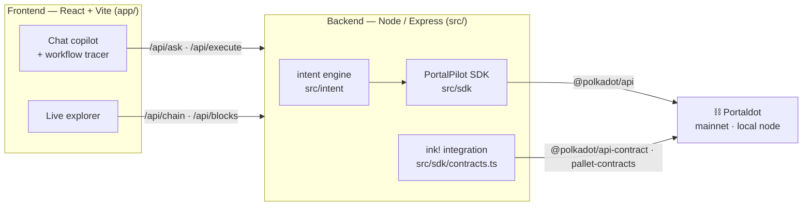

<div align="center">
  
</div>

# PortalPilot

**PortalPilot DEMO** — the AI copilot & command center for Portaldot. Talk to the chain in plain English; it explains, simulates with the real POT fee, and executes only after you confirm.

> 🌀 **PortalDot Hackathon 2026** · **Track:** AI‑Powered Onchain Workflows · **License:** MIT
> **Live chain:** `wss://mainnet.portaldot.io` · **Token:** POT (14 decimals, ss58 42)

---

## Project Overview

### Problem Statement
Portaldot is a live Substrate blockchain (native token **POT**, `pallet-contracts`/ink!, 25 pallets, 155 extrinsics) — but using it is painfully low‑level:

- **No block explorer** — you can't see blocks, accounts, or transfers.
- **No JS/TS SDK** — only a Python SDK exists.
- **No faucet** and thin docs.
- Every action requires **hand‑built SCALE extrinsics** and knowledge of chain‑specific quirks (POT is **14 decimals**, ss58 prefix **42** — trivially gotten 100× wrong).
- On‑chain transactions are **irreversible**, so one mistake is permanent.

Result: developers waste hours on boilerplate, and non‑developers can't use the chain at all.

### Solution
**PortalPilot** turns the whole chain into a safe conversation:

- **Ask (read, no gas):** balances, accounts, recent blocks, recent transfers, network status, fee estimates.
- **Act (write, POT gas):** send POT, batch/airdrop, post an on‑chain remark — each turned into a **plan** that is **dry‑run simulated on‑chain** (`system.dryRun`), **priced in POT** (`payment.queryInfo`), and executed **only after explicit confirmation**, returning a real receipt (block hash + events).
- **Visible workflow tracer:** a live 7‑stage pipeline (Understand → Compose → Simulate → Price → Confirm → Submit → Finalized).
- **Built‑in live explorer** (the chain has none) and the **first community JS/TS SDK** for Portaldot.
- **ink! contract deploy/call wired** via `pallet-contracts`, plus light/dark UI and mainnet/local switching.

### Blockchain Relevance
PortalPilot is **Substrate‑native**, not a generic/EVM app:

- **Smart contracts:** ink! deploy/call wired through `pallet-contracts` (`@polkadot/api-contract`).
- **Payments / DeFi primitives:** `balances.transferKeepAlive`, `utility.batchAll` (airdrops).
- **DID / identity:** reads the `identity` pallet for on‑chain display names.
- **Native gas:** every write pays **POT** (verified by `treasury.Deposit` + `system.ExtrinsicSuccess`).
- **AI‑onchain workflow:** intent → on‑chain simulation → human authorization (simulate‑before‑sign).

---

## Technical Architecture

### Overall architecture diagram



### Core tech stack
- **Blockchain platform:** Portaldot (Substrate) — mainnet `wss://mainnet.portaldot.io` + local dev node (`ws://127.0.0.1:9944`).
- **Smart contract language:** ink! (Rust), via `pallet-contracts` (deploy/call wired in `src/sdk/contracts.ts`).
- **Frontend framework:** React + Vite (TypeScript).
- **Other components:** `@polkadot/api` + `@polkadot/api-contract`; Node/Express API; deterministic NL parser with an optional Anthropic **Claude** layer.

---

## Smart Contracts

### Contract file directory
- `contracts/flipper/` — ink! flipper bundle location (`flipper.contract`) + build notes.
- `src/sdk/contracts.ts` — deploy/call/query integration over `pallet-contracts`.

### Key contracts list with function descriptions
| Contract | Function | Description |
|---|---|---|
| `flipper` | `new(bool)` | Constructor — sets the initial boolean. |
| `flipper` | `flip()` | Mutating call — toggles the stored value (pays POT gas). |
| `flipper` | `get() -> bool` | Read‑only query — returns the current value. |

Copilot commands: **“deploy flipper” → “flip the contract” → “read the flipper”.**

### Deployment instructions
```bash
# On Linux/macOS with the ink! toolchain
rustup target add wasm32-unknown-unknown && rustup component add rust-src
cargo install cargo-contract --locked
cargo contract new flipper && cd flipper && cargo contract build --release
cp target/ink/flipper.contract  <repo>/contracts/flipper/flipper.contract
```
Then, in the app on the **Local** network, say **“deploy flipper”**. The copilot instantiates it via `contracts.instantiateWithCode`, paying POT gas. *(The contract's ink!/metadata version must match the target node's `pallet-contracts`. All read/transfer/batch/remark features run natively with POT gas and need no contract.)*

---

## Installation & Setup

### Requirements
- **Node.js 18+** and npm.
- *(For POT‑gas writes)* a Portaldot node — the bundled local dev binary (Linux; use **WSL** on Windows). Reads, fee preview and dry‑run work against **mainnet** with no node and no tokens.

### Steps
```bash
# 1. Clone
git clone https://github.com/ismailridwans/portaldot-hackathon-2026-portalpilot-aerofyta.git
cd portalpilot

# 2. Install dependencies
npm install
npm install --prefix app

# 3. Compile & deploy — start a local Portaldot node for POT-gas writes (WSL/Linux)
#    (download per docs, then:)
./portaldot_dev --dev --rpc-cors all          # funded Alice/Bob at ws://127.0.0.1:9944

# 4. Launch frontend (optional dev mode: web :5173 + api :8787)
npm run dev
#    or single command, one port (http://127.0.0.1:8787):
npm run build && npm start
```
Optional: set `ANTHROPIC_API_KEY` in `.env` to enable the Claude NL layer (the deterministic parser works without it).

---

## Demo
- **Video link:** `‹add your demo video URL›`
- **Live demo link (optional):** `http://localhost:5173` (dev) · `http://127.0.0.1:8787` (built) — mainnet reads are live.
- **Test accounts / test data:** Substrate dev accounts (funded on a local `--dev` node):
  - `//Alice` → `5GrwvaEF5zXb26Fz9rcQpDWS57CtERHpNehXCPcNoHGKutQY` (default signer)
  - `//Bob` → `5FHneW46xGXgs5mUiveU4sbTyGBzmstUspZC92UhjJM694ty`
  - Try: `balance of alice` · `send 1 POT to bob` · `airdrop 1 POT to bob and 2 POT to charlie` · `network status`

---

## Roadmap

### Completed features
- NL intent engine (deterministic core + optional Claude).
- TypeScript SDK over `@polkadot/api` (POT 14 dp, ss58 42) — first JS/TS SDK for Portaldot.
- Reads: balances, accounts, recent blocks, recent transfers, network status, fee estimate.
- Writes: transfer, batch/airdrop, on‑chain remark — each with **dry‑run + POT fee + confirm**.
- Live 7‑stage workflow tracer; built‑in live explorer.
- Light/dark themes, mainnet/local switching, click‑to‑copy hashes.
- ink! contract deploy/call wired via `pallet-contracts`.

### Next phase plans (optional)
- Wallet‑extension signing (Polkadot.js / Talisman / SubWallet) — non‑custodial.
- ink! contract **live** deploy against a compatible node.
- Multisig & scheduled actions; spend limits / allowlists.
- Publish `@portalpilot/sdk` to npm; hosted public deployment.

---

## Team
- **Team name:** AeroFyta
- **Members & roles:** AeroFyta — Builder · full‑stack & Substrate integration
- **Contact info (hackathon use only):** `‹email or Discord handle›`

---

## License
**MIT** — see [LICENSE](./LICENSE).
